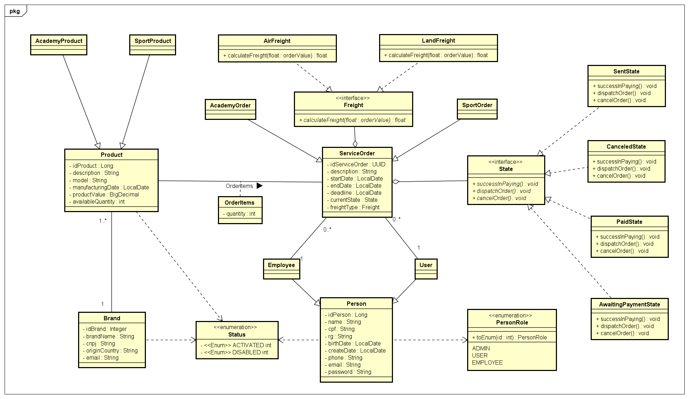

<h1 align="center">Gym Project</h1>

O Gym Project é um projeto sobre um serviço de uma loja virtual feita para gerenciar pedidos de produtos esportivos e de academia. O projeto implementa requisições CRUD em suas chamadas de acesso, além de fazer o uso de Design Patterns para uma possível futura expansão, possibilitando a adição de novos setores, camadas e recursos.

## Diagrama de Classe

## Tecnologias
     
  
## Ferramentas
 

## Como Executar

### Principais Endpoints
<table>
  <tr>
    <th>Método</th>
    <th>Endpoint</th>
    <th>Descrição</th>
  </tr>
  <tr>
    <td>POST</td>
    <td>/user</td>
    <td>Cria um novo usuário</td>
  </tr>
  <tr>
    <td>POST</td>
    <td>/brand</td>
    <td>Cria uma nova marca</td>
  </tr>
  <tr>
    <td>POST</td>
    <td>/sportproduct</td>
    <td>Cria um novo produto esportivo</td>
  </tr>
  <tr>
    <td>POST</td>
    <td>/gymproduct</td>
    <td>Cria um novo produto de academia</td>
  </tr>
  <tr>
    <td>GET</td>
    <td>/sportproduct</td>
    <td>Lista todos os produtos esportivo</td>
  </tr>
  <tr>
    <td>GET</td>
    <td>/gymproduct</td>
    <td>Lista todos os produtos de academia</td>
  </tr>
  <tr>
    <td>POST</td>
    <td>/sportorder</td>
    <td>Cria um novo pedido de produtos esportivos</td>
  </tr>
  <tr>
    <td>POST</td>
    <td>/gymorder</td>
    <td>Cria um novo pedido de produtos de academia</td>
  </tr>
  <tr>
    <td>GET</td>
    <td>/sportorder/{id}</td>
    <td>Lista um pedido de produtos espostivos pelo seu ID</td>
  </tr>
  <tr>
    <td>GET</td>
    <td>/gymorder/{id}</td>
    <td>Lista um pedido de produtos de academia pelo seu ID</td>
  </tr>
  <tr>
    <td>PUT</td>
    <td>/gymorder/{id}</td>
    <td>Atualiza um pedido de produtos de academia</td>
  </tr>
  <tr>
    <td>GET</td>
    <td>/gymorder/{id}/pay</td>
    <td>Efetua pagamento do pedido</td>
  </tr>
  <tr>
    <td>GET</td>
    <td>/gymorder/{id}/dispatch</td>
    <td>Despacha o pedido</td>
  </tr>
  <tr>
    <td>GET</td>
    <td>/gymorder/{id}/cancel</td>
    <td>Cancela o pedido</td>
  </tr>
  <tr>
    <td>DELETE</td>
    <td>/gymproduct/{id}</td>
    <td>Delete um produto de academia</td>
  </tr>
</table>

## Padrões de Design

### Strategy

### State

## Contribuidores
* [José Pedro Vissoti](https://github.com/josevissoti)
* [Enzo Barbosa Dourado de Almeida](https://github.com/enzo-barbosa)
* [Marcelo Henrique Silva Ferreira](https://github.com/marcelohsf)
* <a href="https://github.com/josevissoti" target="_blank">José Pedro Vissoti</a>
